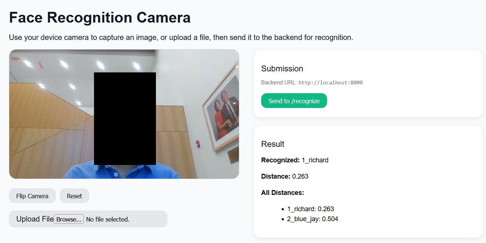

Facial Recognition App
======================

This is a full-stack application that uses a FastAPI backend for face recognition and a React frontend for the user interface, packaged into a standalone main.exe. The React frontend running in a browser acts as the client, capturing and sending images to the backend via a RESTful API for processing. The backend processes the image using the [face_recognition](https://github.com/ageitgey/face_recognition) library and returns a JSON response to the frontend.

*Features*  
-    Real-time Camera Access: Images are captured directly from users' brower webcam. Users can alternatively upload a local image file.
-    Face Recognition: The FastAPI backend, powered by the face_recognition and dlib libraries, processes the captured image to detect and recognize faces.
-    Dynamic Database: The application supports dynamically adding and deleting "known" faces to its recognition database via API endpoints in a session.
-    Standalone Executable: The entire backend, including all Python dependencies and the React build, is bundled into a single .exe file without requiring a Python environment on the user's machine.

Recommended App Run
-------------------
Download the [executable](https://github.com/NightlyTwo58/P6_Face/releases/download/v1.0.0/main.exe) packaged in the [release](https://github.com/NightlyTwo58/P6_Face/releases/). It should be ready for use without any dependencies. When run, it should start a terminal. Make sure to Ctrl+Click the IP address that pops up to open the app hosted locally.  




The developer setup is in detail below.  

Developer Setup
======================

Backend
-------

1. Make sure you have Python installed (3.10+ recommended).  
2. Install dependencies:

   ```pip install -r backend/requirements.txt```

Frontend
--------

1. Make sure you have Node.js and npm installed.  
2. Navigate to the frontend folder and install dependencies:

   ```npm install```

Developer App Run
---------------
Put images of faces you wish to recognize in the backend/data/ folder.  

You need to run both the frontend and backend simultaneously in separate terminals. Navigate to their respective folders before running these commands. You also need to create a /data folder under /backend with face photos to be recognized, and addition /train and /test folders if you choose to use the in-house MobileNetV2 algorithm (you'll also have to run model.py to train first).  
 - face_recognition: produces a 128-D encoding vector per face, and you manually compare with known encodings. Flexible but not trainable.  
 - Keras classifier: learns to directly map raw images → class labels. Requires a fixed training dataset and retraining if you add new people.  

1. Backend:
   
   [face_recognition](https://github.com/ageitgey/face_recognition) algorithm
   
   ```uvicorn main:app --reload --host 127.0.0.1 --port 8000```
   
   in-house training algorithm
   
   ```uvicorn main_classifier:app --reload --host 127.0.0.1 --port 8000```
   
3. Frontend:

   ```npm start```

The React app should open automatically in your browser. If your device has a camera, you can start using it to capture images and send them to the backend for recognition.
